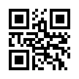
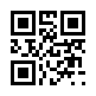

# ポイントカードアプリ

## １．概要
QRコード読み取り型ポイントカードアプリ開発

## ２．目的
このアプリは、頻繁にラーメン屋を利用するユーザーが**紙のポイントカードを紛失したり、持ち忘れたりする**といった課題を解決するために開発しました。

また、**オブジェクト指向プログラミングの理解を深めること**を主な学習目的としています。このプロジェクトを通して、クラス設計の概念を実践的に学びました。

## ３．技術スタック
- 基本構造：HTML,CSS,JavaScript
- ライブラリ：html5-qrcode(QRコード読み取り)
- カメラAPI：	``navigator.mediaDevices.getUserMedia``

## ４．主な機能
- QRコード読み取り
- ポイント加算減算
- ポイント保持
- ポイント使用

## ５．使用方法
以下のQRコードを読み取りする
- **ポイント追加**

- **無効なQRコード**

## ６．推奨環境
- デバイス：Windows11,ios18.6
- ブラウザ：Google chrome 139.0.7258.155

※上記環境で動作確認済み
